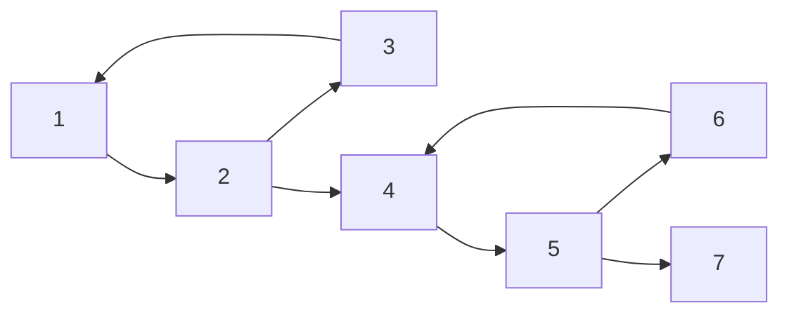
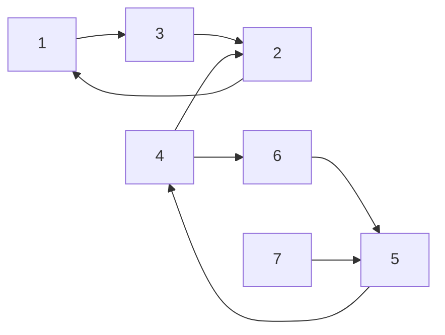

# cmsc451; 02.04.2025

## Strongly connected components

### Example

Take the following graph $G$:

We execute the strong components algorithm on $G$.

First, we run DFS on $G$ to determine finishing orders:
$$
[3, 6, 7, 5, 4, 2, 1]
$$
Next, we take the reversed graph of $G$,

Now we do a DFS over this graph in the order defined by the stack.

First we look at $3$.

- $3$ connects to $2$.
  - $2$ connects to $1$.
    - No more unexplored from $1$.
  - No more unexplored from $2$.
- No more unexplored from $3$.
- First SCC: $\set{1, 2, 3}$.

Then, we look at $6$.

- $6$ connects to $5$.
  - $5$ connects to $4$.
    - No more unexplored from $4$.
  - No more unexplored from $5$.
- No more unexplored from $6$.
- Second SCC: $\set{4, 5, 6}$.

Then, we look at $7$.

- No more unexplored from $7$.
- Third SCC: $\set{7}$.