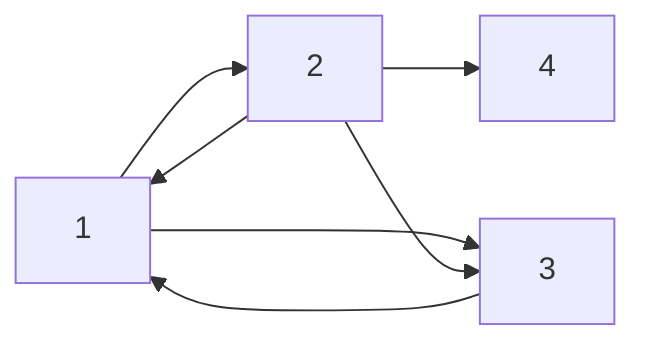

# math401 / final

## google pagerank.

### content.

Pages on the internet are linked. Google ranks these pages in search results using the **Pagerank** algorithm. It takes the following approach:

- A crawler starts on some page.
- If the page has outbound links, there's an $85\%$ chance the crawler goes to one of them (equally likely). There's also a $15\%$​ chance that the crawler instead goes to random possible page (once again, equally likely).
- If there aren't any outbound links, there's a $100\%$ chance the crawler chooses a random next page.
- This process continues forever. *See the Markov chain?!*

Consider the transition matrix of this Markov chain (there are $n$ pages):
$$
T = \frac{0.15}{n} [n \times n \text{ matrix of 1s}] + 0.85 \begin{bmatrix}
	v_1 & v_2 & \dots & v_n
\end{bmatrix}
$$
Where column $v_i$ is defined by:

- If page $i$ has $k$ outbound links, the $j$-th entry $= (\text{page $i$ links to $j$}) \text{ ? } 1/k \text{ : } 0$.
- If page $i$ has no outbound links, each entry is $1/n$​.

We know that $\lambda = 1$​ is an eigenvalue, and can use this to find the corresponding **probability eigenvector**. Recall the probability eigenvector is found by scaling the vector down by the sum of all its entries. 
$$
(T - I_n) \vec{v} = 0
$$
Knowing $1$ is an eigenvalue makes this process feasible at *scale*.

The **pagerank** of page $i$ is then the $i$​-th entry in the probability eigenvector.

### example.

Write out the Google Pagerank transition matrix corresponding to the following internet:

> We will have a $4 \times 4$ matrix. Page $1$ links to $\{2, 3\}$. Page $2$ links to $\{1, 3, 4\}$. Page $3$ links to $\{1\}$. Page $4$ doesn't link to anywhere.
> $$
> T = \frac{0.15}{4}\begin{bmatrix}
> 	1 & 1 & 1 & 1 \\
> 	1 & 1 & 1 & 1 \\
> 	1 & 1 & 1 & 1 \\
> 	1 & 1 & 1 & 1
> \end{bmatrix} + 0.85 \begin{bmatrix}
> 	0   & 1/3 & 1 & 1/4 \\
> 	1/2 & 0 &   0 & 1/4 \\
> 	1/2 & 1/3 & 0 & 1/4 \\
> 	0   & 1/3 & 0 & 1/4 \\
> \end{bmatrix}
> $$

## singular value decomposition. 

### content.

There are numerous ways to factor a matrix, one of which is the **singular value decomposition (SVD)**. For any $m \times n$ matrix $A$, the SVD of $A$ is as follows:
$$
A = U \Sigma V^T
$$

- $U$ is an $m \times m$ orthogonal matrix. 
- $\Sigma$ is an $m \times n$ diagonal matrix with the values $\sigma_1, \dots, \sigma_{\min(m, n)}$ in non-negative and non-increasing order. 
- $V$ is a $n \times n$​ orthogonal matrix.

To construct the SVD of $A$ (the form $U \Sigma V^T$), we do the following:

- Find the common eigenvalues of $A A^T$ and $A^T A$, we call these $\sigma^2_1, \sigma^2_2, \dots$
- $\Sigma$ is the diagonal $m \times n$ matrix whose entries are the roots of these values in non-increasing order.
- For each diagonal value, we populate $U$ and $V$ with the corresponding unit eigenvector $A A^T$ (for $U$) and $A^T A$ (for $V$​)  for those positions.
- Empty columns can be filled with the eigenvector corresponding to the $0$​ eigenvalue.

In MATLAB, we can do `[U, S, V] = svd(A)`.

### example.

Consider the SVD, $A = U \Sigma V^T$, of the following matrix:
$$
A = \begin{bmatrix}
	1.1 & -2.1 & 0 & 3.01 \\
	2.1 & -4.0 & 0.1 & 6.0 \\
	1.9 & -3.9 & 0 & 5.9
\end{bmatrix}
$$
What are the dimensions of $U$, $\Sigma$, and $V$​?

> $U$ will have dimensions $3 \times 3$. $\Sigma$ will be $3 \times 4$. $V$ will have $4 \times 4$.

Write down a reasonable choice for the first column of $U$.

> A reasonable choice is: $\begin{bmatrix} 1 & 2 & 2 \end{bmatrix}^T$​.
>
> Why? Consider the approximate proportions of the values in each column in $A$. They are all very near $1:2:2$, meaning this relationship could be captured by a large singular value.

How do you think the largest and second largest singular values compare?

> Clearly, the entries in the columns are very close to a $1:2:2$ ratio, which is likely captured by the first column. As such, the remaining variance is likely minimal, so there would be a significant different in the magnitude of the first and second singular values. 

## matrix (data) approximation.

The idea here is that each singular value captures some **variance** of the initial matrix. If we can take only the largest singular values, capturing the majority of variance, we can simplify the data.

Say there are $k$ total singular values and we preserve the largest $j$, the **preserved variance** is:
$$
\frac{s_1^2 + \dots + s_j^2}{s_1^2 + \dots + s_k^2}
$$
We swap the matrix $\Sigma$ with $\Sigma'$ (with $j$ singular values) and compute $A' = U \Sigma' V^T$. Assuming $||A - A'||$ is small (which it should be), the columns of $A'$ should be close to those of $A$. 

## image compression.

### content.

We convert an image to grayscale, and then to a matrix. Say it's an $n \times n$ pixel image. Our matrix would then be $n \times n$, which each entry corresponding to the pixel color ($0$ is black and $1$ is white).

By finding the SVD of this matrix and preserving a subset of the largest singular values, we can reduce the data used to store the image, while maintaining adequate quality (determined by the **preserved variance**, see last section).

### example.

Consider the following three images on which you are doing image compression. The resolution
is not given but is not necessary to answer any of the questions.

- Image 1: top half white, bottom half black.
- Image 2: bottom left triangular half black, top right triangular half white (split diagonally).
- Image 3: Some white/black split that's just shy of being horizontal, the split line is slightly diagonal.

Which would require the greatest number of singular values to preserve $95\%$ of the total
image variance? Explain.

> I would say image 2. If we converted it to a color matrix of its pixels, it would have the most drastic changes in the ratios of each column entry. As such, this variation would require more singular values to effectively represent $95\%$.

Which would require the least singular values? Explain.

> Image 1. Converted to a color matrix of its pixels, each columns' entries maintain the exact same ratios. As such, it needs minimal singular values to capture $95\%$ total variance.

Suppose the first ten singular values corresponding to Image 2 are:
$$
\{ 77.9329, 8.8938, 7.2413, 4.2090, 3.7989, 2.7587, 2.5765, 2.0533, 1.9507, 1.6364 \}
$$
If the total image variance is $6287.5$, how much image variance is preserved if the image
is compressed by preserving the largest $3$​ singular values?

> The largest $3$ values are $77.9329, 8.8938, 7.2413$​. Keeping only these, total variance preserved:
> $$
> \frac{77.9329^2 + 8.8938^2 + 7.2413^2}{6287.5} = 0.9868 \approx 98.68\% \text{ preserved}
> $$

## character recognition.

Say we have a few ways to construct an $n \times n$ character (letter). These ways are each $n \times n$ pixel matrices. *Unroll* them into an $n \times 1$ column vector, and put all the columns together in a matrix $A$. Find the SVD, $A = U \Sigma V^T$​. 

Choose the first few columns of $U$ (depending on their corresponding singular values). Let's say we choose $k$ columns to build our **character basis matrix**, which spans the **character subspace**.
$$
B = \begin{bmatrix}
	u_1 & u_2 & \dots & u_k
\end{bmatrix}
$$
To determine how closely a given $n \times n$ drawing matches the character defined by our basis $B$, we first unroll the drawing into an $n \times 1$ column vector $x$. We want to see how close this unrolled matrix is to our character subspace:
$$
||x - B B^T x||
$$

## graph theory.

A **graph** is a bunch of **vertices** connected (or not) by **edges**. If all vertices can reach each other by traveling edges, the graph is **connected**. The **degree** of a vertex is the number of edges connected to it. 

The **adjacency matrix** for a with $n$ vertices is an $n \times n$ matrix of $1$s and $0$s, where $A_{ij} = 1$ if there is an edge from $i$ to $j$. All other entries are zero. The **degree matrix** is the $n \times n$ diagonal matrix where $a_{ii}$ is the degree of vertex $i$.

The **Laplacian matrix** $L = D - A$.

A **$k$-partition** of a graph splits the vertices into $k$ disjoint subsets.  The **Fiedler method** is a way to partition a graph:

1. The **Fiedler value** is the *second smallest* real eigenvalue of $L$​. The corresponding eigenvector is the **Fiedler vector**.
2. We can partition the vertices of the graph based on the entries of the Fiedler vector.
   1. A possible $2$-partition, split the vertices into two sets based on whether their Fiedler vector entry is positive or negative. If it's zero, we can make the more reasonable choice ourselves.
   2. Or, sometimes the Fiedler vector entries are clumped together. Partition the vertices by these clumps. 
   3. Or, split them into the largest and smallest halves (two clumps).

Questions like "What is the Fiedler Method attempting to do here?" Consider how the resulting subsets are connected? The answer, depending on the case, has to do with one (or both) of the following:

1. *Minimize* the number of edges between partitions. 
2. *Maximize* the connectedness within each partition.

## cryptography.

We can use a recurrence to build a key, called a **linearly recursively defined key** of length $i$. It is defined by two vectors:

- $s = [x_1; x_2; \dots; x_i]$.
- $c = [c_1 = 1; c_2; \dots; c_n]$.

From these vectors, we have:
$$
x_n = (1 x_{n - i} + c_2 x_{n - i + 1} + \dots + c_{i - 1} x_{n - 2} + c_i x_{n - 1}) \mod{2}
$$
Mod $2$ stuff:

- Multiplication in mod $2$: If $0$ is a factor, product is $0$. Else $1$​.
- Addition (or subtraction): Perform addition like they're decimal numbers. And then take $\% 2$.

For any given $m$, let $M_m$ be the following matrix:
$$
M_m = \begin{bmatrix}
	x_1 & x_2 & \dots & x_m \\
	x_2 & x_3 & \dots & x_{m + 1} \\
	\vdots & \vdots & \ddots & \vdots \\
	x_m & x_{m + 1} & \dots & x_{2m - 1}
\end{bmatrix}
$$
Important:

- If $\det(M_m) = 1\mod 2$, then no linear recursion of length $< m$ will satisfy our sequence $x_1, x_2, \dots, x_{2m - 1}$.

- If $\det(M_m) = 0 \mod 2$ and if there's a linear recursion of length $m$ that satisfies the sequence, there exists a linear recursion of length $< m$​ that also satisfies it.

The length of the shortest recurrence will be the largest $m$ for which $\det(M_m) = 1 \mod 2$​.

Once we have found some $m$ that we think may work, we solve the following matrix equation. If the equation can be solved, we have found an acceptable solution for the coefficients. 
$$
M_m \begin{bmatrix}
	c_1 \\ c_2 \\ \vdots \\ c_m
\end{bmatrix} = \begin{bmatrix}
	x_{m + 1} \\ x_{m + 2} \\ \vdots \\ x_{2m}
\end{bmatrix}
$$

