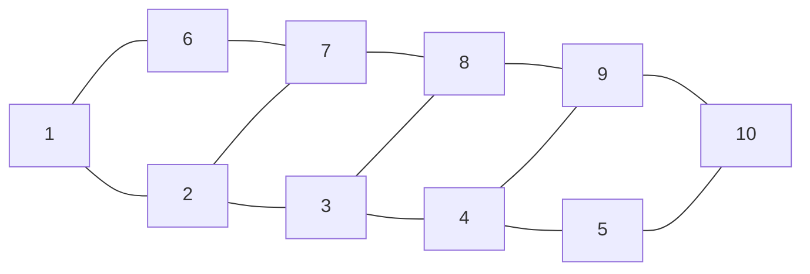

# math475 / exam03

## formula sheet.

$G$ is **$k$-colorable** if it can be colored by $k$ colors, s.t. no adjacent vertices share a color.

**Chromatic number** $\chi(G)$ is smallest $k$ for which $G$ is $k$-colorable.

$G$ is **bipartite** *iff* it doesn't contain an odd cycle.

If $G$ is $k$-regular and bipartite, it contains a **perfect matching**.

**Hall's theorem:** $A_1, \dots, A_k$ have a SDR when $|A_i \cup \dots \cup A_k|$​.

$G$ is $k$-critical if removing any subgraph decreases $\chi(G)$​.

$G$​ is **Eulerian** *iff* all vertices have even degree.
$$
\begin{align*}
	t(G) &= \min_{S \sube V(G)} \frac{|S|}{c(G - S)} &\text{toughness of graph $G$} \\
	t(G) &\leq \frac{|S|}{c(G - S)} &\text{where $S$ is any subset of $V(G)$}
\end{align*}
$$
If $G$ is Hamiltonian, then $t(G) \geq 1$​.

**Ore's Theorem:** If order of $G$, $n \geq 3$ and $\deg u + \deg v \geq n$ for any two non-adjacent vertices in $G$, then $G$​ is Hamiltonian.

The chromatic number of a graph with multiple components is just the chromatic number of the largest component. 

## colorings.

**Definition:** A **coloring** of a graph is a way to assign colors to each vertex such that each vertex has a color that differs from its neighbors.

**Example:** Consider a bunch of cell towers that all broadcast a frequency. Two cell towers can only broadcast the same frequency if they are more than $50$ miles apart from each other. Can we find the smallest number of frequencies possible?

> We can use **graph colorings** to solve this problem. Let $G$ be the graph whose vertex set is the set of all cell towers. We draw an edge between all towers that are at most $50$​ miles apart. 
>
> Any valid coloring of the graph would represent a legitimate way to assign frequencies to the towers, as any two towers that are within $50$ miles from each other will always have different "colors" aka frequencies.

**Definition:** A graph is **$k$-colorable** if it can be colored by $k$​ colors, such that no adjacent vertices of the same color. 

**Definition:** The **chromatic number** of graph $H$, denoted $\chi(H)$, is the smallest number $k$ for which the graph $H$ is $k$​-colorable.

> Clearly, the solution to our minimum frequencies problem is just $\chi(G)$.

**Example:** The chromatic number of the pentagon is three.

> A pentagon is essentially the $C_5$ graph:
>
> ```mermaid
> flowchart LR
> 	1---2
> 	2---3
> 	3---4
> 	4---5
> 	5---1
> ```
>
> We try to alternate the colors RED and BLUE to the vertices in the cycle. Our coloring is $1$ RED, $2$ BLUE, $3$ RED, $4$ BLUE, $5$ RED. But $5$ and $1$ are connected, so this cannot work. Instead color $5$ with GREEN, and $C_5$ is $3$-colorable. Since $C_5$ is not $2$-colorable but it is $3$​-colorable,
> $$
> \chi(C_5) = 3
> $$

**Definition:** The **maximum independent set** of $G$ is the largest possible set that contains non-adjacent vertices in $G$. Its cardinality, the **independence number**, is denoted $\alpha(G)$.

**Definition:** A **clique** is a complete subgraph. The **clique number**, denoted $\omega(G)$, is the number of vertices in the largest **clique** of $G$.

## bipartite graphs.

**Definition:** Graph $G$ is **bipartite** when its vertex seti can be split into $2$ partite sets $S$ and $T$ such that every edge of $G$ connects a vertex of $S$ to a vertex of $T$.

A **bipartite graph** is a special name for a $2$​​​-colorable graph. When the vertices are split into sets by their coloring, it follows that each vertex will only connect to a vertex in the opposite set.

**Example:** The triangle is *not* bipartite.

> The triangle is just the $C_3$ graph. However, in the $C_3$ graph, each vertex is connected to the other two vertices, so there is no way to split them into two partite sets. 
>
> Say we have vertex $1$, $2$, and $3$. If we color $1$ RED, then $2$ and $3$ must be the same color BLUE as they are in the neighborhood of $1$. But then $2$ and $3$ are also connected, so it cannot be bipartite. 
>
> As such, a graph that contains a triangle cannot be bipartite either. Even if the remaining vertices can be $2$-colored, the triangle part cannot be.

**Theorem:** A graph $G$ is bipartite *if and only if* it does not contain an odd cycle.

> **Proof ("only if"):** If $G$ contains an odd cycle of length $2k + 1$, with vertices $1...2k+1$, we must alternate odd and even colors in order to $2$-color the cycle. Both vertex $1$ and $2k + 1$ of the cycle are odd, meaning they will receive the same color. However, they are adjacent, and thus the graph cannot be bipartite.
>
> **Proof ("if"):** meow.

**Theorem:** Let $G$ be a simple bipartite graph on $n$ vertices. Then $G$ has at most $\frac{n^2}{4}$ edges.

> **Proof:** $G$ has two partite sets, $S$ (of length $s$) and $T$ (of length $n - s$). Clearly, to maximize the number of edges, we draw an edge from every vertex in $S$ to every vertex in $T$, resulting in $s(n - s)$ total edges. We can find the $s$ that maximizes this value:
> $$
> \begin{align*}
> 	E(s) &= s(n - s) = sn - s^2 \\
> 	E'(s) &= n - 2s = 0 &\text{set to 0 to maximize} \\
> 	2s &= n \\
> 	s &= \frac{n}{2} \\
> 	E(\frac{n}{2}) &= \frac{n}{2}(n - \frac{n}{2}) = \frac{n^2}{4}
> \end{align*}
> $$

**Definition:** A **complete bipartite graph** contains partite sets $S$ and $T$ where all vertices in $S$ are adjacent to all vertices in $T$.

## matchings.

**Example:** Consider $m$ job openings, and $n$ applicants. We define the graph $G$ on $m + n$ vertices such that $m$ vertices represent openings and $n$ vertices represent applicants. Edges connected applicants with openings that they are qualified for. Clearly, this graph is *bipartite* where our partite sets are the openings and applicants.

**Definition:** The edge set $S$ is a **matching** in graph $G$ when no edges in $S$ share a vertex. When $S$ covers all vertices in $G$​, we call it a **perfect matching**.

**Example:** Consider a $100 \times 100$ checkerboard. There are *exactly* $50$ pieces placed in each row and each column of the board. Using matching theory to prove that $100$ pieces can be chosen, one from each row and one from each column. Clearly explain the graph you are defining.

>Consider the bipartite graph $G$ with two partite sets $R$ and $C$. The set $R$ contains $100$ vertices, each representing a row of the board. Set $C$ also contains $100$ vertices, each representing a column of the board. There exists an edge in $G$ from $R_i$ to $C_j$ if there is a piece on the $i$th row and $j$th column on the board.
>
>Since each vertex in sets $R$ and $C$ has $50$ edges leaving it, $G$ is a $50$-regular bipartite graph. Since all $k$-regular bipartite graphs contain a perfect matching, each element in $R$ can be matched to a unique element in $C$, thus we can choose a certain $100$ pieces that encompass all rows and all columns on the board!

## eulerian graphs.

**Definition:** A **Eulerian circuit** on graph $G$ is a walk that starts at vertex $V$ and returns to $V$ after traversing all edges in $G$ exactly once. $G$ is an **Eulerian graph** if it contains a Eulerian circuit.

**Theorem:** A connected graph $G$ is Eulerian if and only if all vertices of $G$ have an even degree.

>**Proof ("only if"):** Let $G$ be a Eulerian graph with Eulerian circuit $W$. Every vertex on the circuit must be "entered" and "left,"  so that the circuit can return back to the starting vertex while traversing all edges. Since each time a vertex is entered is matched with a time that it is left, and the Eulerian circuit must cover all possible edges, each vertex must be left the same number of times that it is entered. If a given vertex $G_i$ is entered $i$ times, it must be left $i$ times as well, leading to a degree of $2i$​ for that vertex. As such, each vertex must have even degree. 
>
>**Proof ("if"):** meow.

## hamiltonian graphs.

**Definition:** A **Hamiltonian cycle** is one that traverses all vertices exactly once, with the exception of the starting vertex which is obviously seen twice. $G$ is a **Hamiltonian graph** if it contains a Hamiltonian cycle.

**Definition:** the toughness of a graph $G$ 

**Theorem:** All Hamiltonian graphs have $t(G) \geq 1$.

## planar graphs.

**Definition:** A **planar graph** is one that can be drawn such that no two edges overlap.

**Note:** The graphs $K_5$ (star inscribed in pentagon) and $K_{3, 3}$​ are **non-planar**. 

**Definition:** A **subdivision** of a graph can be formed by "smoothing out" vertices of degree $2$.

**Theorem (Kuratowski's):** Every non-planar graph has a subgraph or subdivision of the graphs $K_5$ or $K_{3, 3}$.

**Example:** Show using Kuratowski's Theorem that the Petersen graph is non-planar.

> Basically, we remove a subgraph of the Petersen graph, and then take a subdivision by "smoothing out" the remaining graph to find $K_{3, 3}$. Therefore, the Petersen graph cannot be planar.

**Theorem (Euler's Planar):** For a planar graph with $v$ vertices, $e$ edges, and $f$ faces:
$$
v - e + f = 2
$$
**Theorem:** For any planar graph with order $n \geq 3$ and size $m$, $m \leq 3n - 6$. 

## mycielski's construction.

**Theorem (Mycielski's):** There exists graph $G$ with $\omega(G) = 2$ but an arbitrarily large $\chi(G)$.

Another interpretation: we can have triangle free graphs with an arbitrarily large chromatic number.

**Definition:** The **Mycielskian** of $G$, $\mu(G)$, contains $G$ as a subgraph, together with $n + 1$ additional vertices. To construct the Mycielskian of graph $G$:

1. Let $G$ have $n$ vertices, $v_1, v_2, \dots, v_n$. Draw $n + 1$ additional vertices, $u_1, u_2, \dots, u_n, w$.
2. Connect $w$ to all $u$-vertices. 
3. Where $v_i \sim v_j$, draw an edge from $u_i$ to $v_j$.

## practice problems.

**Question:** Let $A_1 = \{2, 3, 7, 8\}$, $A_2 = \{1, 2\}$, $A_3 = \{2, 3, 6\}$, $A_4 = \{1, 6, 7, 8\}$, $A_5 = \{1, 2, 6\}$, and $A_6 = \{1, 2, 3\}$. 

**(a)**	Determine if this family of sets has a system of direct representatives. 

> Choose $7, 1, 3, 8, 6, 2$ from $A_1, A_2, A_3, A_4, A_5, A_6$, respectively. This is a clear example of a system of direct representatives.

**(b)**	Does this answer change if we add $A_7 = \{1, 3, 6\}$​?

> We apply Hall's Theorem. $A_1 \cup A_2 \cup \dots \cup A_7 = \{2, 3, 7, 8, 1, 6\}$. This set only contains six elements, which is less than $7$, the number of sets. So an SDR cannot exist on these seven sets.

**Question:** Prove that the Petersen graph is NOT Hamiltonian. Assume the contradiction and let the Hamiltonian cycle on the graph be $v_1, v_2, v_3, \dots, v_{10}, v_1$. 

**(a)**	Using only what is given, what vertices could $v_1$ join to?

>  It can only join to $v_5$, $v_6$, or $v_7$, to maintain the condition that the girth is $5$.

**(b)**	Suppose $v_1$ joins to $v_6$. If all other edges are created in a similar manner, what is the problem?

> In a similar manner, we have $v_2$ connecting to $v_7$. This forms a $4$-cycle, $v_1, v_6, v_7, v_2, v_1$, which breaks the girth condition of the Petersen graph.

**(c)**	We now look at the other cases from (a). Now what is wrong? Complete the proof.

> In both the cases that $v_1$ joins to $v_5$ or to $v_7$, connecting any other vertex to $v_6$ results in a new cycle of length less than $5$, breaking the girth condition of the Petersen graph. This leads to a contradiction in all cases, and the Petersen graph cannot be Hamiltonian. $\square$

**Question:** Consider the graph below.



**(a)**	Determine if the graph is Hamiltonian and/or Eulerian.

> The graph is clearly Hamiltonian, as there is a cycle $1, 2, 3, 4, 5, 10, 9, 8, 7, 6, 1$​.
>
> The graph cannot be Eulerian, as vertex $7$ has odd degree. 

**(b)**	Determine the toughness of the graph.

>Formula for toughness: $t(G) = \min_{S \sube V(G)} \frac{|S|}{c(G - S)}$. Since it's Hamiltonian, $t(G) \geq 1$. 
>
>Remove the vertices $2$ and $7$. We have now $2$ connected components in $G$, so $t(G) \leq \frac{2}{2}$.
>
>If $t(G)$ is both $\leq$ and $\geq 1$, it must be equal to $1$.

**Question:** Suppose a graph is Hamiltonian, not Eulerian, but contains a Eulerian trail. Assume that the graph has $7$ vertices and $12$ edges, and $\delta(G) = 2, \Delta(G) = 5$. There are two vertices with deg $2$. Determine all possible values for the total vertices with degree $3, 4, 5$.

>Since $G$ is not Eulerian, it must contain at least one vertex with odd degree. We know $2$ vertices have a degree of $2$, and $G$ has a total degree of $12 \cdot 2 = 24$. This leaves a degree of $24 - 4 = 20$ to be contributed by the remaining $5$ vertices. Let $v_3, v_4, v_5$ be the number of vertices with degree $3, 4, 5$, respectively:
>$$
>\begin{align*}
>	3v_3 + 4v_4 + 5v_5 &= 22 \\
>	v_3 + v_4 + v_5 &= 5
>\end{align*}
>$$
>A simple graph must contain an even # of vertices with odd degree, so $v_3 + v_5 \in \{2, 4\}$.
>
>**Case 1:** There are two odd-degree vertices. This means there are $3$ vertices of degree $4$, leaving degree of $20 - 4(3) = 8$ to be contributed by vertices of degree $3$ and $5$. Since $3 + 5 = 8$, a possible outcome is then one vertex of degree $3$ and $5$, and two vertices of degree $4$.
>
>**Case 2:** There are four odd-degree vertices. This means there is $1$ vertex of degree $4$, leaving degree of $22 - 4 = 18$ to be contributed by vertices of degree $3$ and $5$. There is no way to make $18$ from exactly $4$ vertices of degree $3$ and $5$​, so there are no possible values in this case.
>
>As such, there is one possible set of values: $v_3 = 1, v_4 = 3, v_5 = 1$.

**Question:** The complete tripartite graph $K_{a, b, c}$ is the graph on $a + b + c$ vertices with three partite sets of size $a, b, c$. For $a \leq 1$, determine the following.

**(a)**	Is the graph $K_{a, 2a, 3a}$ Hamiltonian?

> Apply Ore's Theorem. Order $n = 3a + 2a + a = 6a$. The max degree of two non-adjacent vertices is $3a + 3a = 6a$. Since $6a \geq 6a$, $K_{a, 2a, 3a}$ is Hamiltonian.

**(b)**	Is the graph $K_{a, 2a, 3a + 1}$ Hamiltonian?

> Recall that $t(G) \geq 1$ when a graph $G$ is Hamiltonian. Remove the two partite sets of size $a$ and $2a$. It follows that $|S| = 3a$, but $c(K_{a, 2a, 3a + 1} - S) = 3a + 1$.  So the toughness of the graph must be $\leq \frac{3a}{3a + 1} < 1$. Therefore, the graph cannot be Hamiltonian.

**Question:** Let $G$ be a connected planar graph with $\delta(G) \geq 3$. Prove by contradiction that at least $2$ faces have at most $5$ edges. 

> Assume the contradiction: less than $2$ faces have at most $5$ edges. Recall Euler's identity:
> $$
> n - m + f = 2
> $$
> In this case, we know that $m \geq \frac{3n}{2} \rightarrow 2m \geq 3n$. Let $k$ be the number of faces with over $5$ edges. Consider the following two cases:
>
> **Case 1:** there are exactly zero faces with at most $5$ edges. In this case, we can say $m \geq 6f$, as all faces are comprised of at least $6$ edges:
> $$
> \begin{align*}
> 	n + f &= 2 + m \\
> 	3n + 3f &= 6 + 3m \\
>     2m + 3f &\geq 6 + 3m \\
>     4m + 6f &\geq 12 + 6m \\
>     4m + m = 5m &\geq 12 + 6m \\
>     -m &\geq 12 \\
>     m &\leq -12
> \end{align*}
> $$
> From the above, we have found that there is at most $-12$ edges in our graph. This is clearly an impossible and is a contradiction.
>
> **Case 2:** there is exactly one face with at most $5$ edges. We know that $f - 1$ faces consist of at least $6$ edges, and $1$ face consists of at most $5$. So, we know that $f - 1 \leq \frac{m - 5}{6}$ or $6f - 6 \leq m - 5$ or $6f - 1 \leq m$:
> $$
> \begin{align*}
> 	3n + 3f &= 6 + 3m \\
> 	2m + 3f &\geq 6 + 3m \\
> 	4m + 6f &\geq 12 + 6m \\
> 	4m + 6f - 1 &\geq 12 + 6m \\
> 	6f - 1 &\geq 12 + 2m \\
> 	m &\geq 12 + 2m
> \end{align*}
> $$
> $m$ is a positive integer, so it cannot be greater than or equal to $2m + 12$. This is clearly an impossible and is a contradiction.

**Question:** We say $G$ has an odd component if the component has an odd number of vertices. Suppose graph $H$ is a *connected* graph on $n$ vertices with a perfect matching. Prove for any subset $S$ of disconnecting vertices, the total odd components of $H - S$ does not exceed $|S|$​.

> After disconnecting the vertices in $S$ from $H$, there must exist at least one unmatched vertex in each resulting odd component, which can be matched with a vertex in $S$. As such, the total number of odd components cannot exceed the number of vertices in $S$​.

The **wheel graph** $W_n$ is the graph on $n$ vertices where vertex $n$ joins to all vertices in a $C_{n - 1}$.

- Is $W_n$​ Eulerian? Hamiltonian?
  - The graph is Hamiltonian. Let vertices $1$ through $n - 1$ make up the cycle, and vertex $n$ be the center vertex. You can traverse $1, 2, 3, \dots, n-1, n, 1$.
- Without proof, what is $\alpha(W_n)$​​​?
  - $\alpha$ is the independence number. Since the center vertex connects to all nodes, it cannot be part of a maximum independence set. This leaves our $C_{n-1}$ cycle. The independence number of this cycle, and therefore the wheel, is $\text{floor}(\frac{n - 1}{2})$​. 
- What is $\chi(W_n)$? Justify.
  - We focus on coloring solely the outer cycle. If it has an even number of vertices, i.e., $n - 1$ is even, then we can color the cycle with two colors. If it has an odd number in vertices, i.e., $n - 1$ is odd, then we cannot color the cycle with two colors, but we can do it in $3$​ colors.  We must assign another color to the center vertex, since it connects to all vertices in the cycle. So, $\chi(W_n) = 3$ when $n$ is odd ($n - 1$ is even). For the other case, $\chi(W_n) = 4$ when $n$ is even ($n - 1$ is odd).

**Question:** Generalize Euler's identity to a disconnected graph with $k$ components. 

> Ideally, we would want to sum the faces in each component, but we must account for the fact that one face is shared across all components, the "outer face." Recall Euler's identity:
> $$
> n - m + f = 2
> $$
> We remove one face for each component and add it back at the end. Let component $C_i$ have order $n_i$, size $m_i$, and faces $f_i$:
> $$
> \sum_{i = 1}^{k} (n_i - m_i + f_i) = k
> $$
> Evaluating the sum and adding back the outer face,
> $$
> n - m + f = k + 1
> $$

**Question:** Prove that if $G$ is $k$-critical, it must be connected.

> Assume that $G$ is disconnected. In this case, its chromatic number must be equal to the largest chromatic number of its components. If we now remove one of the components with a smallest chromatic number, the chromatic number does not decrease, as the component with largest chromatic number remains. Here we have a contradiction, so $G$ must be connected if it is $k$-critical.  

**Question:** Given graph $G$, the line graph of $G$ denoted $L(G)$ is the graph whose vertex set is $E(G)$ and an edge set $u_i \sim u_j$ in $E(L(G))$ if and only if the corresponding edges in $G$ were incident to a common vertex. Show if $G$ is Eulerian, that $L(G)$ is also Eulerian.

> Consider that each vertex in $G$ has an even degree, or even number of edges leaving it. As a result, each edge in $L(G)$ must connect an even number of vertices. 	
